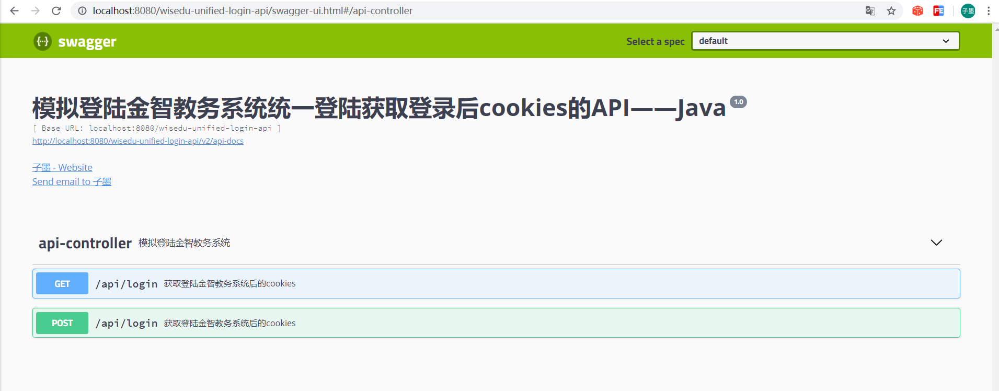
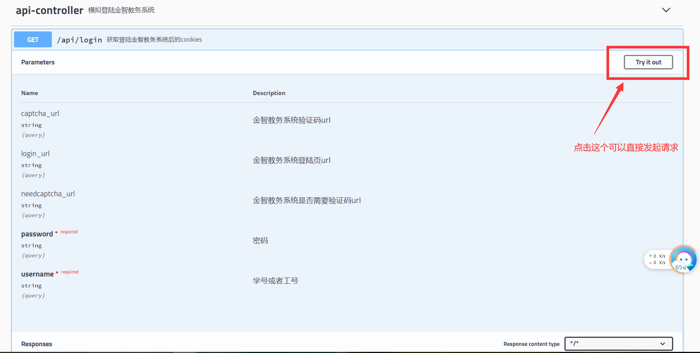

# wisedu-unified-login-api
模拟登陆`金智教务统一登陆系统`的API，可集成但不限于校园小程序，查成绩，课表，校园卡，二手市场等应用中

# 点个star支持一下吧

# 声明

1. **本项目仅供学习交流使用，如作他用所承受的任何直接、间接法律责任一概与作者无关**
2. 如果此项目侵犯了您或者您公司的权益，请联系[作者](tencent://Message/?Uin=461009747&websiteName=q-zone.qq.com&Menu=yes)删除

# 项目结构

1. 源代码基于`springboot`构建
2. ide是`IntelliJ IDEA 2019.3.3`
3. 相关源文件说明
    ```shell script
    \wisedu-unified-login-api
    │  .gitignore # git版本管理配置
    │  pom.xml # maven依赖包管理
    │  README.md # 说明文件
    │  tree.txt # 项目树形结构，使用tree命令生成
    │  
    ├─src # 源代码文件夹
    │  ├─main # main
    │  │  ├─java # java代码
    │  │  │  └─wiki
    │  │  │      └─zimo
    │  │  │          └─wiseduunifiedloginapi # basePackage
    │  │  │              │  WiseduUnifiedLoginApiApplication.java # springboot启动类
    │  │  │              │  
    │  │  │              ├─configuration # 配置
    │  │  │              │      SwaggerConfiguration.java # 注入swagger到spring容器
    │  │  │              │      
    │  │  │              ├─controller # controller
    │  │  │              │      ApiController.java # api
    │  │  │              │      
    │  │  │              ├─helper # 一些工具
    │  │  │              │      AESHelper.java # aes加密解密
    │  │  │              │      ImageHelper.java # 图片保存和二值化处理
    │  │  │              │      TesseractOCRHelper.java # ocr识别验证码
    │  │  │              │      
    │  │  │              └─service # service
    │  │  │                  │  LoginService.java # 模拟登陆
    │  │  │                  │  
    │  │  │                  └─impl
    │  │  │                          LoginServiceImpl.java # 模拟登陆实现
    │  │  │                          
    │  │  └─resources
    │  │      │  application.yml # springboot配置
    │  │      │  
    │  │      ├─static
    │  │      └─templates
    │  │              describe.html # 一个帮助生成功能描述的html
    │  │              
    │  └─test # test
    │      └─java
    │          └─wiki
    │              └─zimo
    │                  └─wiseduunifiedloginapi
    │                          WiseduUnifiedLoginApiApplicationTests.java
    │
    ├─screenshots # 截图
    └─tessdata # tess4j 训练集
        │  eng.traineddata
        │  osd.traineddata
        │  pdf.ttf
        │  pdf.ttx
        │  
        └─configs
                api_config
                digits
                hocr
                
    
    ```

# [api文档](http://www.zimo.wiki:8080/wisedu-unified-login-api-v1.0/swagger-ui.html#/api-controller)

1. 部署系统后访问`http://host:port/wisedu-unified-login-api-v1.0/swagger-ui.html#/api-controller`可查看文档(点击本章标题也可以查看文档)
    
2. `host`：为你的服务器地址，如果是本地，默认是`localhost`
3. `port`：为你的服务器端口，如果未修改，默认是`8080`
4. 此文档为swagger生成，可点击`Try it out`测试接口
    
5. 模拟登陆成功后的返回
    ```json
    {
        "msg": "login success!",
        "code": 0,
        "cookies": "route=c02e1c52cb44ccedc7a00ac44a74ab3c;JSESSIONID=sKnaX6W3z7rN5AB9cQJ4An3OX3aOwq3aziPc4FIVW641bc_ihwXK!-173725045;CASTGC=TGT-1394-3FaIbOEbJ4RVrhgVrtVPRNzNNcODy6V3RMXRblvJdAfL5H3qMc1588506634030-QUpr-cas;CASPRIVACY=;iPlanetDirectoryPro=QCMaHbaG7vdSgN1QuSldJ0;asessionid=5ad7f5b4-eb74-4c3c-a694-76d24ea97b3f;MOD_AUTH_CAS=MOD_AUTH_ST-96230-7W9q97JkbbFzRLhj7hRr1588506634075-YBLG-cas"
    }
    ```
6. 模拟登陆失败后的返回
    ```json
    {
        "msg": "login failed! 用户名或者密码错误",
        "code": 1,
        "cookies": null
    }
    ```
7. 默认配置针对宜宾学院，其他学校如果想设置为默认设置可以更改配置文件

# 依赖

1. tess4j：用于ocr识别验证码
2. fastjson：用于处理json数据
3. swagger：用于生成api文档
4. jsoup：用于解析html代码

# 其他

1. 理论上支持几乎所有的金智教务系统，`iap`或者`cas`，`加密`或者`没加密`均支持
2. 电子科技大学的金智教务系统<s>由于加密和混淆过于变态，暂时没有时间分析，所以不支持</s>，突然混淆又没有了，应该是支持了，但未测试，有点意思（手动狗头）

# 部署

1. 请先在服务器配置好`tessreact`，**非常重要**，安装和配置可以参考[我的博文](https://blog.zimo.wiki/posts/c417f07b/)
2. 在[release](https://github.com/ZimoLoveShuang/wisedu-unified-login-api/releases)中下载打包好的`war`包，或者`jar`包
3. `war`包放入`tomcat`等容器中，jar包使用`java -jar wisedu-unified-login-api-v1.0.jar &`命令执行
4. enjoy it !!!
5. [点此直达对新手小白更加友好的部署教程](https://blog.zimo.wiki/posts/6c809f81/)

# 更新

- 2021-03-10 兼容`notcloud`认证方式更新后出现`HTTP error fetching URL`的bug v1.0.19
- 2021-03-07 兼容`cloud`认证方式更新后出现`Must supply a valid URL`的bug v1.0.18
- 2021-02-02 适配淮阴师范学院的登陆过程 v1.0.17
- 2021-01-14 适配江苏科技大学的登陆过程 v1.0.16
- 2020-12-30 适配合肥工业大学更新后的登陆过程 v1.0.15
- 2020-12-24 适配合肥师范学院的登陆过程 v1.0.14
- 2020-12-15 适配成都信息工程大学新版教务系统，优化部分代码和错误提示 v1.0.13
- 2020-12-03 修复河南大学更新后的登录过程 v1.0.12
- 2020-11-17 适配山东城市建设职业学院的登陆过程 v1.0.11
- 2020-11-10 适配武汉轻工大学更新后的登陆过程 v1.0.10
- 2020-11-09 解决福建农林大学认证服务器出现的500错误 v1.0.9
- 2020-10-05 适配昆明学院的登陆过程 v1.0.8
- 2020-09-26 支持再次更新后的CLOUD方式认证接口 v1.0.7
- 2020-09-14 适配安徽建筑大学的登陆过程 v1.0.6
- 2020-09-14 信任所有证书，解决部分学校https服务器证书不正确问题 v1.0.5
- 2020-08-28 修复中国矿业大学更新后的登陆过程 v1.0.4
- 2020-08-03 更新`springboot`版本为`2.3.1.RELEASE`，便于和`springcloud Hoxton.SR6`项目集成；新增路由`/`转发到`swagger-ui.html`，便于查看文档 v1.0.3
- 2020-07-14 抽取登陆实现过程；根据login_url自动匹配验证码url等接口 v1.0.2
- 2020-06-03 支持更新后的CLOUD方式认证接口 v1.0.1
- 2020-05-08 开源模拟登陆API接口 v1.0

# 捐赠

1. 如果觉得作者做得不错，想捐赠我的话，请扫描下面的二维码
<table>
    <tr>
        <td ><center></center></td>
        <td ><center></center></td>
    </tr>
</table>